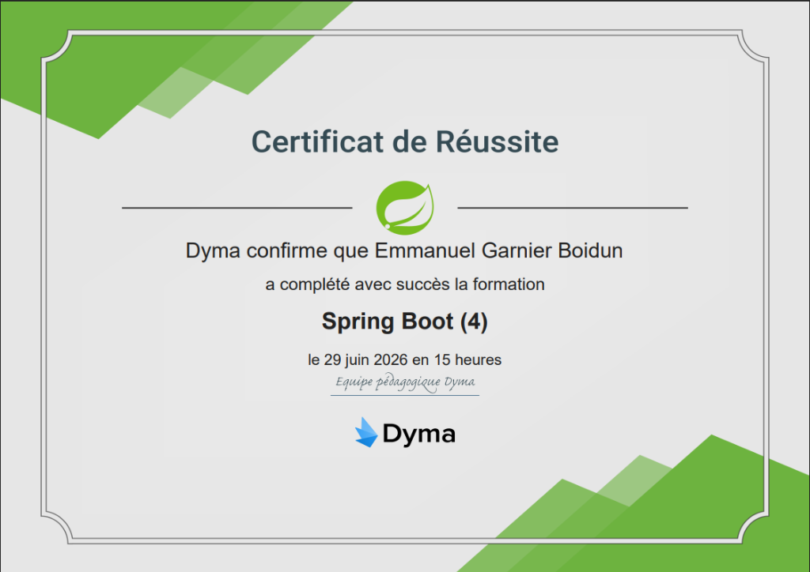

# 🎾 Dyma Tennis API

> Projet réalisé dans le cadre de la **certification Spring Boot** sur [Dyma.fr](https://dyma.fr).

<p align="center">
  
</p>

API REST de gestion de joueurs et tournois de tennis, développée avec **Spring Boot 4**, **Java 17**, **PostgreSQL**, et **Keycloak** pour l'authentification OAuth2/JWT.

[](https://github.com/GARNIER-Emmanuel/dyma-tennis/actions/workflows/ci.yml)

---

## 📋 Prérequis

* **Java 17** (JDK)
* **Docker** & **Docker Compose**
* **Maven** (optionnel, le wrapper `./mvnw` est inclus)

---

## 🗄️ 1. Démarrage des services Docker

### Base de données PostgreSQL

#### Mode Développement (Port : `5434`)
```bash
docker compose -f src/main/docker/postgresql.yml up -d
```

#### Mode Production (Port : `5424`)
```bash
docker compose -f src/main/docker/prod/postgresql.yml up -d
```

### Keycloak (Port : `8090`)

Keycloak est utilisé comme serveur d'identité OAuth2 / OpenID Connect :
```bash
docker compose -f src/main/docker/keycloack.yml up -d
```

> [!NOTE]
> Keycloak démarre sur [http://localhost:8090](http://localhost:8090).
> Les identifiants de la console d'administration (realm `master`) sont `admin` / `admin`.

---

## 🚀 2. Lancement de l'Application

### Via Maven (Wrapper)

#### 🛠️ En mode Développement (Profil `dev`)
```bash
./mvnw spring-boot:run "-Dspring-boot.run.profiles=dev"
```

#### 🏭 En mode Production (Profil `prod`)
```bash
./mvnw spring-boot:run "-Dspring-boot.run.profiles=prod"
```

### Via le JAR compilé

1. **Générez l'archive `.jar`** :
   ```bash
   ./mvnw clean package
   ```
2. **Exécutez l'application** :
   ```bash
   java -jar target/dyma-tennis.jar --spring.profiles.active=dev
   ```

---

## 🐳 3. Exécution avec Docker

Le projet intègre un `Dockerfile` multi-stage permettant de compiler et d'exécuter l'application de façon isolée.

```bash
# Builder l'image
docker build -t dyma-tennis-api .

# Lancer le conteneur
docker run --name dyma-tennis \
  -p 8080:8080 \
  --net prod_default \
  -e SPRING_PROFILES_ACTIVE=prod \
  -e SPRING_DATASOURCE_URL=jdbc:postgresql://dyma-postgre-production:5432/postgres \
  -e SPRING_DATASOURCE_USERNAME=postgres \
  -e SPRING_DATASOURCE_PASSWORD=password \
  -d dyma-tennis-api
```

---

## 🔒 4. Sécurité & Authentification (Keycloak)

L'API est sécurisée avec **Spring Security** et **Keycloak** (OAuth2 Resource Server + JWT).

### Obtenir un token d'accès

Envoyez une requête `POST` sur `/accounts/token` avec vos identifiants :
```json
{
  "login": "admin",
  "password": "admin"
}
```

Vous recevrez un `access_token` JWT à inclure dans le header `Authorization: Bearer <token>` pour les requêtes protégées.

### Comptes par défaut (realm `dyma`)

| Identifiant | Rôle(s) | Accès |
| :--- | :--- | :--- |
| `admin` | `ROLE_ADMIN`, `ROLE_USER` | Lecture + écriture + suppression |
| `user` | `ROLE_USER` | Lecture seule (`GET`) |

> [!IMPORTANT]
> Les utilisateurs sont gérés dans Keycloak (realm `dyma`), et non plus en base de données locale.
> L'ancien système d'authentification JWT local est conservé en commentaire dans le code à titre de référence.

---

## 🏗️ 5. Architecture

Le projet suit une architecture **Vertical Slice Architecture (VSA)** :

```
src/main/java/com/dyma/tennis/
├── features/
│   ├── accounts/        → Authentification (login, token Keycloak)
│   ├── players/         → CRUD joueurs, classement, ranking
│   └── tournaments/     → CRUD tournois, inscription de joueurs
└── shared/
    ├── error/           → Gestion globale des erreurs
    ├── health/          → Health check
    └── security/        → Configuration Spring Security, Keycloak
```

---

## 🧪 6. Tests

Le projet contient **26 tests** (unitaires, intégration, end-to-end) utilisant **JUnit 5**, **Mockito**, **MockMvc**, et **H2** en mémoire.

```bash
./mvnw test
```

Un **workflow GitHub Actions** (`ci.yml`) exécute automatiquement les tests à chaque push et pull request sur `main`.

---

## 🔍 7. Documentation de l'API (Swagger UI)

Une fois l'application démarrée :
* **Swagger UI** : [http://localhost:8080/swagger-ui/index.html](http://localhost:8080/swagger-ui/index.html)

### Endpoints principaux

| Méthode | Endpoint | Rôle requis | Description |
| :--- | :--- | :--- | :--- |
| `POST` | `/accounts/token` | Public | Obtenir un token JWT |
| `GET` | `/players` | `ROLE_USER` | Lister les joueurs |
| `GET` | `/players/{identifier}` | `ROLE_USER` | Détails d'un joueur |
| `POST` | `/players` | `ROLE_ADMIN` | Créer un joueur |
| `PUT` | `/players` | `ROLE_ADMIN` | Modifier un joueur |
| `DELETE` | `/players/{identifier}` | `ROLE_ADMIN` | Supprimer un joueur |
| `GET` | `/tournaments` | `ROLE_USER` | Lister les tournois |
| `GET` | `/tournaments/{identifier}` | `ROLE_USER` | Détails d'un tournoi |
| `POST` | `/tournaments` | `ROLE_ADMIN` | Créer un tournoi |
| `PUT` | `/tournaments` | `ROLE_ADMIN` | Modifier un tournoi |
| `DELETE` | `/tournaments/{identifier}` | `ROLE_ADMIN` | Supprimer un tournoi |
| `GET` | `/healthcheck` | Public | Health check |